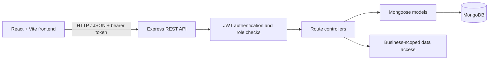

# StorMate

<p align="center">
  <strong>Inventory, orders, and business operations in one multi-tenant workspace.</strong>
</p>

<p align="center">
  <a href="https://stor-mate.vercel.app">Live application</a> ·
  <a href="https://stormate-8p52.onrender.com/api-docs">API reference</a> ·
  <a href="docs/architecture.md">Architecture</a>
</p>

<p align="center">
  <a href="https://github.com/ZilkarNayeen/StorMate/blob/main/LICENSE"></a>
  
  
  
  
</p>

StorMate is a full-stack inventory and business management application for teams that need to manage products, stock, suppliers, users, and orders. Its multi-tenant model scopes operational data to a business, while role-based access distinguishes platform-level administration from business operations.

> **Project status:** StorMate is an actively developed portfolio project. Review the [security notes](#security-features) and configure production secrets and origins before using it with real business data.

## Overview

StorMate models a SaaS-style business hierarchy:

- A **superadmin** provisions business administrators.
- A **business admin** manages users and operations for their business.
- **Staff** work with business inventory and operational records.
- Business data is associated with a tenant identifier and accessed through authenticated workflows.

The hosted frontend and API are available at [stor-mate.vercel.app](https://stor-mate.vercel.app) and [stormate-8p52.onrender.com](https://stormate-8p52.onrender.com/api). Availability depends on the hosting services and deployed database state.

## Features

- **Business-aware access control** with superadmin, admin, staff, and customer roles
- **Tenant-scoped operations** for business data
- **Inventory management** for products and stock adjustments
- **Order workflows** for sales and purchases
- **Supplier and category management**
- **User administration** with business-aware provisioning rules
- **Item transaction tracking** for inventory activity
- **JWT-protected API routes** and bcrypt password hashing
- **Interactive API reference** served by Swagger UI
- **Docker Compose** setup for the backend and MongoDB

## Architecture

The project is organized as a React single-page application backed by an Express REST API and MongoDB.



**Request flow:** the frontend sends API requests through a shared Axios client. Protected routes validate the bearer token, then controller queries use the authenticated user's role and business context to perform operations.

```text
StorMate/
├── frontend/       React + Vite application
├── server/         Express API, routes, controllers, models, middleware
├── docs/           Architecture, database, deployment, security, portfolio notes
├── Dockerfile      Backend container image
└── docker-compose.yml
```

See [Architecture](docs/architecture.md) and [Database Design](docs/database-design.md) for more detail.

## Screenshots

There are no product screenshots committed in the repository yet. Add reviewed screenshots under `docs/screenshots/` and link them here when available. Suggested views:

| View | Screenshot |
| --- | --- |
| Dashboard | _Add `docs/screenshots/dashboard.png`_ |
| Inventory | _Add `docs/screenshots/inventory.png`_ |
| Orders | _Add `docs/screenshots/orders.png`_ |

## Installation

### Prerequisites

- Node.js 20 or later recommended
- npm
- MongoDB running locally or a MongoDB Atlas connection string

### 1. Clone the repository

```bash
git clone https://github.com/ZilkarNayeen/StorMate.git
cd StorMate
```

### 2. Install dependencies

```bash
npm install --prefix server
npm install --prefix frontend
```

### 3. Configure environment variables

Create `server/.env` using the [Environment Variables](#environment-variables) section. Create `frontend/.env` to point the frontend at your local API.

### 4. Start the API

```bash
npm --prefix server start
```

The API connects to MongoDB at startup. The server also ensures demo account records exist if no superadmin is found; do not use demo credentials or automatic demo data initialization in a production deployment.

### 5. Start the frontend

```bash
npm --prefix frontend run dev
```

Open the Vite URL printed in the terminal (typically `http://localhost:5173`). The API listens on `http://localhost:5713` by default; the health endpoint is `/api/health`.

To create or refresh seed data explicitly, review `server/seed.js` and run:

```bash
npm --prefix server run seed
```

## Environment Variables

### Backend: `server/.env`

| Variable | Required | Description | Example |
| --- | --- | --- | --- |
| `PORT` | No | HTTP port; defaults to `5713` | `5713` |
| `MONGO_URI` | Yes | MongoDB connection string | `mongodb://127.0.0.1:27017/storemate` |
| `JWT_SECRET` | Yes | Secret used to sign and verify JWTs | Use a long, random secret |

Example:

```env
PORT=5713
MONGO_URI=mongodb://127.0.0.1:27017/storemate
JWT_SECRET=replace-with-a-long-random-secret
```

### Frontend: `frontend/.env`

| Variable | Required | Description | Example |
| --- | --- | --- | --- |
| `VITE_API_BASE_URL` | Recommended | API base URL, including `/api` | `http://localhost:5713/api` |

The frontend currently has a deployed API URL as its fallback. Set `VITE_API_BASE_URL` explicitly for local development, previews, and each deployment environment.

Never commit `.env` files or production credentials. Any secret included in a `VITE_` variable is bundled into browser code and must be treated as public.

## API Documentation

Swagger UI is served by the backend at:

- Local: `http://localhost:5713/api-docs`
- Hosted: [`https://stormate-8p52.onrender.com/api-docs`](https://stormate-8p52.onrender.com/api-docs)

The API base path is `/api`. The following route groups are registered:

| Resource | Base path | Examples |
| --- | --- | --- |
| Health | `/api/health` | `GET /api/health` |
| Authentication | `/api/auth` | `POST /api/auth/login` |
| Categories | `/api/categories` | List and category management |
| Suppliers | `/api/suppliers` | List and supplier management |
| Products | `/api/products` | List, create, update, delete, stock changes |
| Orders | `/api/orders` | List, create, update, delete |
| Item transactions | `/api/itemTransaction` | Inventory transaction operations |
| Users | `/api/users` | List users and create users (protected) |

Protected endpoints expect a bearer token in the `Authorization` header:

```http
Authorization: Bearer <jwt>
```

The Swagger document currently describes a subset of the implemented routes. Treat the route handlers as the source of truth if an operation is not present in the interactive reference.

## Docker Setup

The included Compose file starts the backend and MongoDB. From the repository root:

```bash
docker compose up --build
```

The API is exposed on `http://localhost:5713`; MongoDB is exposed on port `27017`. Data is persisted in the Compose-managed `mongodb_data` volume.

Stop the services with:

```bash
docker compose down
```

To also remove the local database volume, run `docker compose down -v` (this permanently deletes the MongoDB data stored in that volume).

**Important:** the checked-in Compose configuration uses a development JWT secret. Replace it with a unique secret for local use and never use that value in a public or production environment. Configure CORS and database network access appropriately before exposing services beyond localhost.

## Deployment

The deployed project uses Vercel for the frontend and Render for the API. MongoDB can be hosted through MongoDB Atlas or another compatible managed service.

### Frontend

1. Import the repository into Vercel and set the project root to `frontend`.
2. Configure `VITE_API_BASE_URL` to the deployed API URL ending in `/api`.
3. Build using `npm run build`; Vite outputs the static site to `dist`.
4. Deploy and verify the login page and API connectivity.

### Backend

1. Create a Node.js service on Render with the repository's `server` directory as its root, or deploy the provided Dockerfile from the repository root.
2. Set `MONGO_URI`, `JWT_SECRET`, and `PORT` in the service environment.
3. Ensure the MongoDB network rules permit the backend to connect.
4. Verify the service health endpoint at `/api/health` and the Swagger UI at `/api-docs`.

Keep frontend and backend URLs aligned, configure allowed CORS origins for your actual deployment, and use separate credentials for development and production. See [Deployment Guide](docs/deployment.md).

## Security Features

- Password hashing with bcrypt
- JWT authentication for protected API routes
- Role-based authorization middleware for restricted user operations
- Business-aware access and tenant-scoped data patterns
- Required server secrets supplied through environment variables

These are baseline protections, not a claim of a completed security audit. The current server enables permissive CORS, and the repository's Compose file contains a development-only JWT secret. Before handling real user or business data, restrict CORS, rotate and protect secrets, remove or disable demo-account initialization, add request validation and login rate limiting, and review tenant filtering across every controller. See [Security Review](docs/security-review.md).

## Future Roadmap

- [ ] Add automated API tests for authentication, authorization, and tenant isolation
- [ ] Expand and validate the OpenAPI specification against all implemented endpoints
- [ ] Add shared request validation and centralized error handling
- [ ] Add login rate limiting and configurable CORS allowlists
- [ ] Add pagination, filtering, and sorting for growing datasets
- [ ] Add audit history for privileged and inventory-changing operations
- [ ] Add CI checks for linting, tests, and production builds
- [ ] Add current product screenshots and a short walkthrough

## Contributing

Issues and pull requests are welcome. For substantial changes, open an issue first to discuss the expected behavior. Please avoid including real customer information, credentials, or production database data in issues and test fixtures.

## License

StorMate is distributed under the [MIT License](LICENSE).