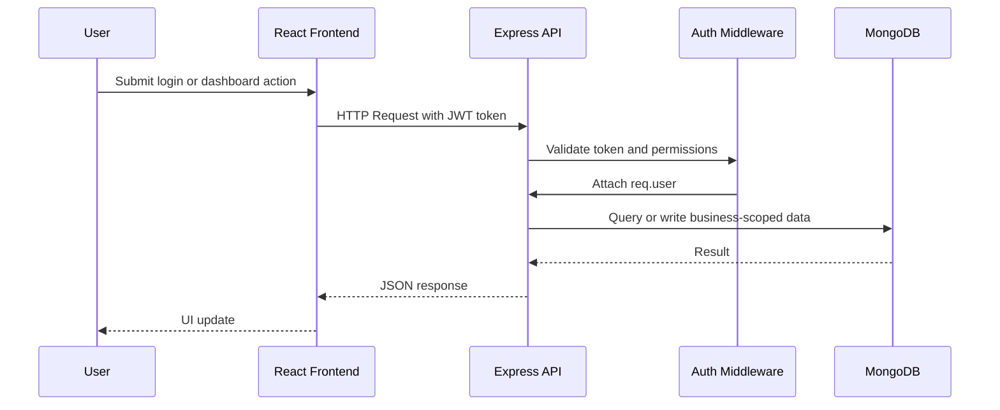
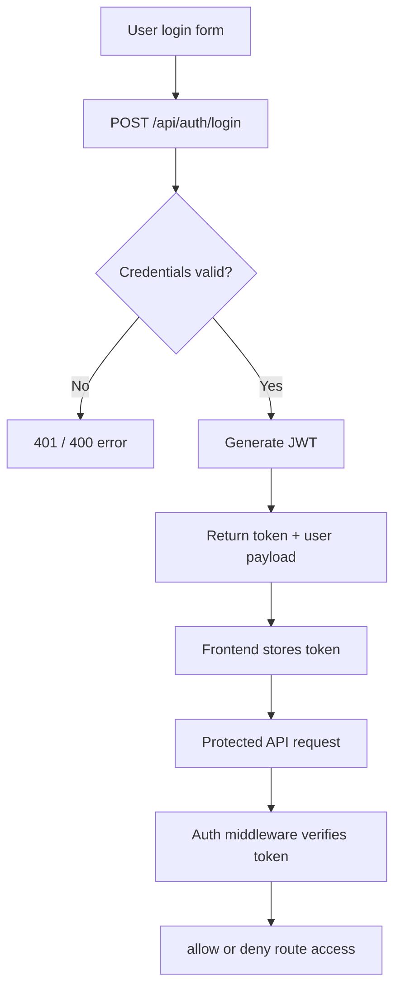
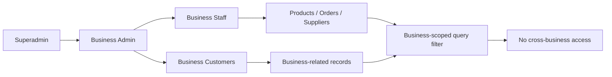

# Architecture Overview

## 1. Project Purpose

StorMate is a multi-tenant inventory, ordering, and business management application designed to support role-based operational workflows for small and medium businesses. The application separates business data by `businessId`, enforces access control via JWT authentication, and provides a shared operational interface for admins, staff, and customers.

## 2. Architectural Style

The project follows a layered full-stack architecture:

- Frontend layer: React + Vite single-page application
- API layer: Express.js REST API
- Business logic layer: controllers and middleware
- Data access layer: Mongoose models interacting with MongoDB
- Security layer: JWT verification and role-based access middleware

This structure is a practical implementation of the standard controller-service-model pattern without introducing unnecessary abstraction layers for a portfolio project.

## 3. Frontend Architecture

The frontend is a React SPA responsible for:

- login and session management
- rendering dashboard pages and admin screens
- interacting with business-owned resources through the REST API
- presenting inventory, supplier, order, and product workflows

The frontend communicates with the backend using a shared Axios instance configured from `frontend/src/utils/api.js`.

## 4. Backend Architecture

The backend is built using Express and organized around route-level responsibilities:

- `/api/auth` for login and authentication
- `/api/users` for user provisioning
- `/api/products` for product and stock logic
- `/api/orders` for sales and purchase order creation
- `/api/categories` for category management
- `/api/suppliers` for supplier management
- `/api/businesses` for business-level management

Controllers encapsulate business logic. Models define the MongoDB schema. Middleware enforces authentication and authorization rules.

## 5. Frontend-Backend Interaction

## 6. Authentication Flow

Authentication is JWT-based and follows the standard bearer token workflow:

1. User submits credentials to `/api/auth/login`.
2. Server finds the user by email and validates password with bcrypt.
3. Server creates a JWT signed with `JWT_SECRET`.
4. The frontend stores the token in browser storage.
5. Protected routes require the token in the Authorization header.
6. Middleware verifies the token and attaches the user object to `req.user`.

## 7. Multi-Tenant Business Isolation

One of the strongest architectural features of the project is the tenant isolation model.

- Each user may belong to a business via `businessId`.
- Product, order, transaction, and user records are scoped by business.
- The auth middleware attaches the authenticated user and their business.
- Business-level queries use `req.user.businessId` to ensure a user cannot access another business’s records.

This is a good example of practical multi-tenancy without complex sharding or separate database per tenant.

## 8. Database Interaction Pattern

The application uses Mongoose models for schema validation and basic business rules. MongoDB documents are queried using tenant-aware filters such as:

- `Product.find({ businessId: req.user.businessId })`
- `Order.find({ businessId: req.user.businessId })`
- `User.findOne({ email: normalizedEmail })`

This pattern reduces accidental cross-business leaks and keeps request semantics explicit.

## 9. Strengths of the Current Architecture

- Clear separation between routes, controllers, and database models
- Practical JWT-based auth flow
- Business-scoped access logic for tenant safety
- Simple and understandable project structure for learning and portfolio use
- Fast iteration because the app is modular but not over-engineered

## 10. Graduate-Level Considerations

For a senior-level or graduate portfolio, this architecture demonstrates:

- secure API design principles
- user-role awareness
- business data boundaries
- operational workflow understanding
- real-world SaaS style design without overengineering

## 11. Recommendations for Future Growth

The current architecture is suitable for a portfolio and internship application, but future improvements could include:

- service layer separation for business logic
- custom error classes and centralized error handling
- validation schemas using Joi or Zod
- pagination and filtering for large datasets
- audit trails and soft-deletion patterns
- caching for frequently queried inventory data

## 12. Summary

StorMate is a mature and well-scoped project that demonstrates practical full-stack engineering, business logic modeling, and secure multi-tenant data handling. It is a good fit for a graduate portfolio because it balances real-world domain modeling with maintainable code organization.
