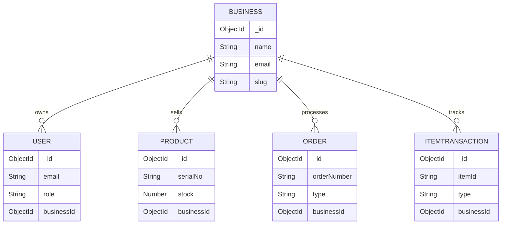

# Database Design

## 1. Overview

StorMate uses MongoDB as the primary persistence layer and Mongoose as the ODM for schema definition and validation. The database is designed for business-scoped access patterns, where records are associated with a `Business` and accessed only within that tenant context.

## 2. Collections

### 2.1 Business

Purpose: represents a distinct business or tenant.

Fields:

- `_id`: ObjectId
- `name`: String
- `email`: String, unique
- `slug`: String, unique
- `createdAt`, `updatedAt`: timestamps

Relationship:

- One business contains many users
- One business contains many products
- One business contains many orders
- One business contains many transactions

### 2.2 User

Purpose: stores authenticated users and their role and business membership.

Fields:

- `_id`: ObjectId
- `name`: String
- `email`: String, unique
- `password`: String, hashed
- `address`: String
- `role`: enum (`superadmin`, `admin`, `staff`, `customer`)
- `businessId`: ObjectId referencing `Business`
- `createdAt`, `updatedAt`: timestamps

Role logic:

- `superadmin`: globally authorized owner account
- `admin`: business-level admin for a tenant
- `staff`: business operations staff
- `customer`: business customer or external party if needed

### 2.3 Product

Purpose: tracks all product catalog entries for a business.

Fields:

- `_id`: ObjectId
- `name`: String
- `category`: String
- `price`: Number
- `stock`: Number
- `serialNo`: String
- `supplier`: String
- `businessId`: ObjectId referencing `Business`
- `createdAt`: Date

Important rules:

- `serialNo` is unique within a business
- `businessId` is required
- quantity must remain non-negative

### 2.4 Order

Purpose: records sales or purchase orders for a business.

Fields:

- `_id`: ObjectId
- `orderNumber`: String
- `type`: `sales` or `purchase`
- `customerSupplier`: String
- `items`: embedded array with product name, quantity, and unit price
- `totalAmount`: Number
- `expectedDate`: Date
- `notes`: String
- `businessId`: ObjectId referencing `Business`
- `createdAt`, `updatedAt`: timestamps

Business rule:

- `orderNumber` is unique per business.

### 2.5 ItemTransaction

Purpose: stores inventory audit or movement log entries.

Fields:

- `_id`: ObjectId
- `itemId`: String
- `type`: `receipt`, `dispense`, or `adjustment`
- `quantity`: Number
- `note`: String
- `user`: String
- `price`: Number
- `businessId`: ObjectId referencing `Business`
- `createdAt`: Date

This collection acts like a transaction ledger for stock movement and operational traceability.

## 3. Relationships

## 4. Index Strategy

The project uses explicit indexes to support queries and uniqueness:

- `User.email` unique
- `Business.email` unique
- `Business.slug` unique
- `Product.serialNo + businessId` unique
- `Order.orderNumber + businessId` unique

Purpose of indexes:

- prevent duplicates in tenant-scoped records
- speed up login queries by email
- speed up business queries
- support inventory uniqueness per business

## 5. Data Flow

### User creation flow

1. Request is validated.
2. Email is normalized and checked for uniqueness.
3. New record is created with role and business association.
4. Password is hashed by the Mongoose pre-save hook.
5. User document is saved.

### Order creation flow

1. Authenticated user submits order payload.
2. System creates an `Order` record with `businessId`.
3. For each item, product stock is updated based on order type.
4. Transaction log is inserted into `ItemTransaction`.
5. New inventory state is persisted.

### Business-scoped access flow

1. JWT is decoded by middleware.
2. Request user is loaded from database.
3. Queries are filtered using `req.user.businessId`.
4. No business-level data is exposed outside the tenant scope.

## 6. Design Strengths

- Clear tenant boundary through `businessId`
- Strong uniqueness constraints for inventory and user identity
- Role-driven user model aligned to business operations
- Embedded order items reduce join complexity for common order workflows
- Transaction ledger supports auditability

## 7. Design Limitations and Portfolio Notes

The current design is intentionally simple and practical. Future improvements could include:

- separate inventory movement model with richer metadata
- separate order item references instead of embedded item arrays
- soft delete patterns for records and audit trails
- richer filtering and pagination for large datasets
- approval workflows for inventory adjustments

## 8. Summary

The database design is well-suited for a business app portfolio because it demonstrates real tenancy modeling and operational data handling without overcomplicating the architecture. It shows thoughtful use of collection boundaries, uniqueness constraints, and business-scoped access.
