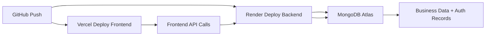

# Deployment Guide

## 1. Deployment Model

StorMate is designed for a modern cloud deployment model:

- Frontend: Vercel
- Backend: Render
- Database: MongoDB Atlas or MongoDB-compatible service

This separation is appropriate for real-world SaaS projects because it keeps the UI, API, and data layer independently scalable and easier to manage.

## 2. Frontend Deployment on Vercel

The frontend is a Vite-based React application. Vercel is a strong fit because it supports SPA deployment with minimal configuration.

### Required environment variable

```env
VITE_API_BASE_URL=https://<your-render-backend-url>/api
```

This value allows the frontend to point to the deployed backend instead of the local development server.

### Vercel notes

- Build command: `npm install && npm run build`
- Output directory: `dist`
- Framework: Vite

## 3. Backend Deployment on Render

The backend is an Express application and is a good candidate for Render because it supports Node.js services, environment variables, health checks, and runtime logs.

### Required environment variables

```env
PORT=10000
JWT_SECRET=your_secure_secret
MONGO_URI=mongodb+srv://<username>:<password>@<cluster>.mongodb.net/<database-name>?retryWrites=true&w=majority
```

### Render deployment steps

1. Connect the GitHub repository to Render.
2. Choose the backend service or Docker deployment.
3. Set the root directory to the `server` folder if needed.
4. Add environment variables.
5. Trigger a manual deploy or push to main.
6. Verify `/api/health` returns a healthy response.

## 4. MongoDB Atlas Setup

MongoDB Atlas is the recommended cloud database for this application.

### Recommended setup steps

1. Create a MongoDB Atlas cluster.
2. Create a database user with read/write permissions.
3. Allow access from Render and local IPs.
4. Copy the connection string into `MONGO_URI`.
5. Test the database connection from the backend service logs.

### Best practices

- Use strong database credentials
- Keep a dedicated user for the application
- Use environment variables instead of hardcoding secrets
- Restrict database access by IP or private networking where possible

## 5. Docker Workflow

The project includes Docker support through `Dockerfile` and `docker-compose.yml`.

### Typical workflow

```bash
docker-compose up --build
```

This is useful for:

- local environment consistency
- demo presentations
- team onboarding
- container-based deployment validation

## 6. Environment Variable Strategy

The application relies on environment-driven configuration rather than hardcoded values.

### Frontend

```env
VITE_API_BASE_URL
```

### Backend

```env
PORT
MONGO_URI
JWT_SECRET
```

This is important for portability and for preventing secrets from being committed to source control.

## 7. Deployment Flow Diagram



## 8. Operational Notes

- Health-check route: `/api/health`
- Successful deployment should return JSON showing server status
- The app should validate that `owner@storemate.com` can authenticate on a correctly seeded database
- Frontend deployment should not assume localhost in production

## 9. Production Readiness Considerations

For a graduate-level portfolio, the deployment architecture is strong because it demonstrates:

- cloud-native separation of concerns
- infrastructure awareness
- environment-based configuration
- secure credential handling
- practical SaaS deployment design

## 10. Future Deployment Improvements

Recommended next steps:

- CI/CD pipeline with lint and test checks
- staging environment separate from production
- environment-specific secrets management
- health monitoring and alerting
- automatic migration or seed validation

## 11. Summary

The project’s deployment model is realistic and appropriate for a professional portfolio. It demonstrates a strong understanding of frontend/backend decoupling, environment variable security, and cloud deployment patterns used in modern production systems.
